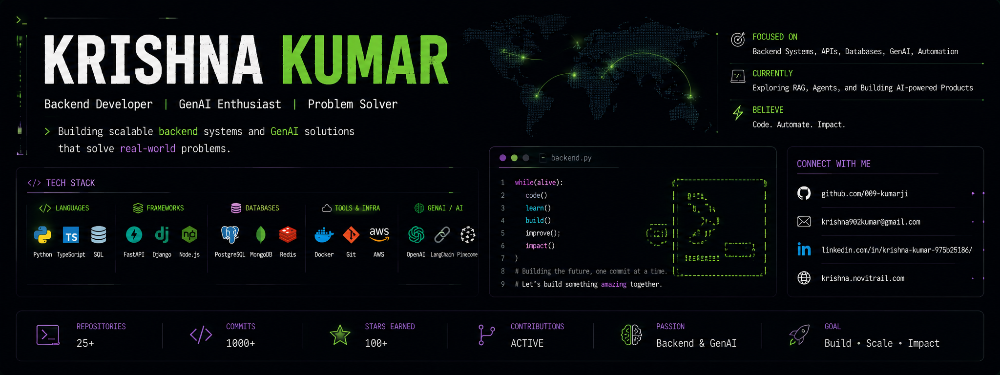

<div align="center">
  
</div>

<div align="center">

[](https://git.io/typing-svg)

</div>

---

### 🧠 About Me

```python
krishna = {
    "role"     : "Associate Software Engineer @ Accenture, India",
    "focus"    : ["GenAI", "Backend Engineering"],
    "building" : "AI-powered products and backend systems that scale",
    "learning" : ["RAG pipelines", "LangChain", "Prompt Engineering"],
    "contact"  : "krishna902kumar@gmail.com",
    "fun_fact" : "I think I'm the funniest in the group 😄"
}
```

---

### 🤖 GenAI Stack

<p>
  
  
  
  
  
  
</p>

### ⚙️ Backend & Infrastructure

<p>
  
  
  
  
  
  
  
  
  
  
</p>

### 🛠️ Languages & Tools

<p>
  
  
  
  
  
  
  
</p>

---

### 📊 GitHub Stats

<div align="center">
  
</div>

<div align="center">
  
</div>

<div align="center">
  
</div>

---

### 🔗 Connect with me

<p align="center">
  <a href="https://linkedin.com/in/krishna-kumar-975b25186" target="_blank">
    
  </a>
  <a href="https://twitter.com/kumaarkrishnaaa" target="_blank">
    
  </a>
  <a href="mailto:krishna902kumar@gmail.com">
    
  </a>
  <a href="https://www.leetcode.com/krishna-09" target="_blank">
    
  </a>
  <a href="https://codeforces.com/profile/009-kumarji" target="_blank">
    
  </a>
  <a href="https://www.github.com/009-KumarJi/resume" target="_blank">
    
  </a>
</p>

<div align="center">
  
</div>
